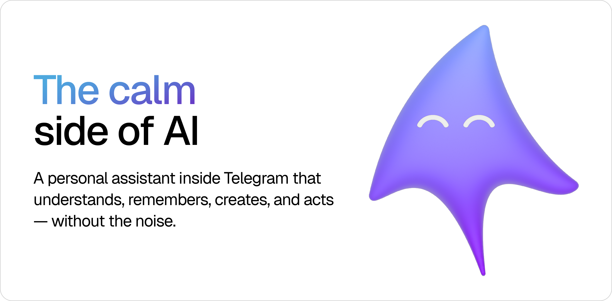

# Meet `Skye`

- [Website](skye-bot.com)
- [Docs](https://docs.skye-bot.com)

## Model provider

Skye supports the native OpenAI path and an additive OpenRouter path. OpenAI remains the default
when only `OPENAI_API_KEY` is set. To switch, set `OPENROUTER_API_KEY`; it takes precedence when
both keys are present. Configure chat, transcription, speech, and image models with
`SKYE_DEFAULT_MODEL`, `SKYE_TRANSCRIPTION_MODEL`, `SKYE_SPEECH_MODEL`, and `SKYE_IMAGE_MODEL`.

OpenRouter runs through its Responses API and provider-hosted web search, web fetch, image
generation, and shell tools. Because that API is stateless, Skye stores the complete Responses
item history in its existing SQLite database and replays a bounded recent window. `/reset` clears
the corresponding local history. The OpenAI path continues to use OpenAI Conversations unchanged.

## Features

### Write as Usual

Skye lives where your conversations, work, and everyday life already happen. There’s no extra app to learn — just write to her the way you would write to a person. Short, by voice, with a photo or a document: she will pick up the context and help you finish the task.

---

### Talk in Text and Voice

Ask questions, think out loud, or send a voice note. Skye will get to the point — and go deeper when you need it. She also works in groups and can help run channels.

---

### Work with Photos and Documents

Create and edit images by saying what you want. Skye can describe a picture, read and compare documents, explain a spreadsheet, and summarize a text.
